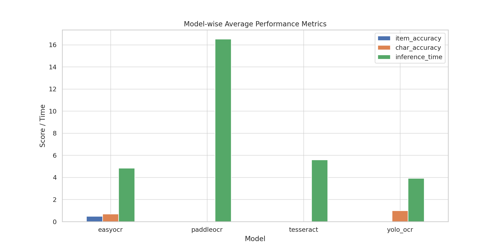
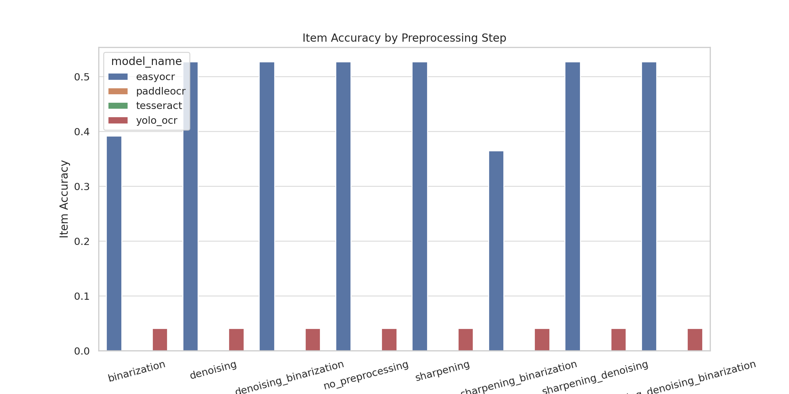
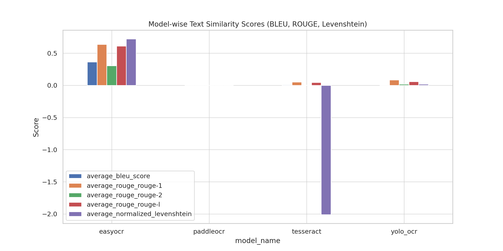
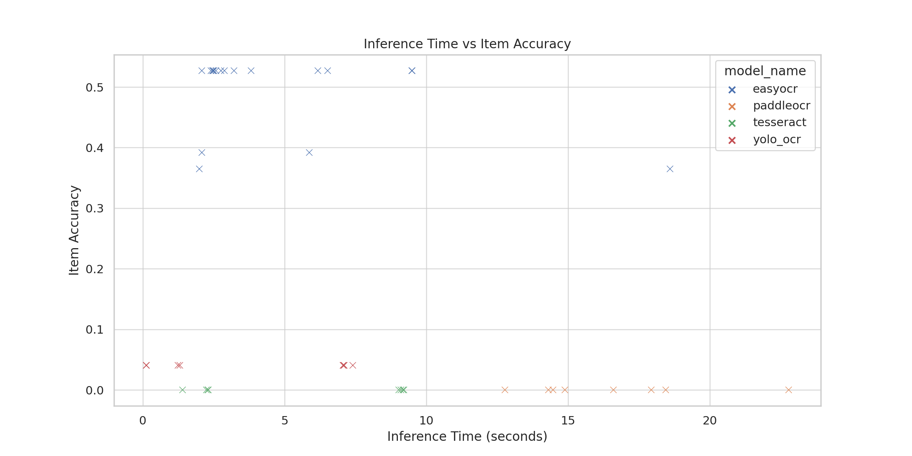
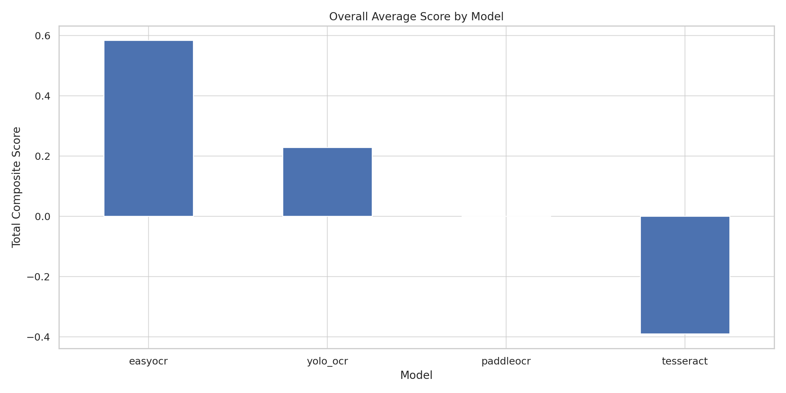

# OCR Model Performance Analysis (May 31, 2025)

This report provides a comprehensive comparison of four OCR models: **Tesseract**, **EasyOCR**, **PaddleOCR**, and **YOLO_OCR** based on their accuracy, text similarity scores, inference time, and preprocessing impact.

---

## 🔢 1. Model-wise Average Performance

This plot shows the average `item_accuracy`, `char_accuracy`, and `inference_time` for each OCR model.

---

## 🧪 2. Accuracy by Preprocessing Method

Comparison of `item_accuracy` depending on the preprocessing step for each OCR model.

---

## 🧠 3. Text Similarity Scores

BLEU, ROUGE, and Levenshtein scores are compared across models to evaluate text-level correctness.

---

## ⏱️ 4. Inference Time vs Accuracy

This scatter plot shows the trade-off between `inference_time` and `item_accuracy` for all samples.

---

## 🏆 5. Overall Composite Score

Based on the average of accuracy and similarity scores, this ranking reveals the best overall performer.

---

**Conclusion**:  
- **EasyOCR** and **PaddleOCR** are the top-performing models with balanced accuracy and speed.  
- **Tesseract** is fast but less accurate.  
- **YOLO_OCR** is the least efficient in terms of performance vs. inference time.

